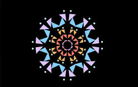
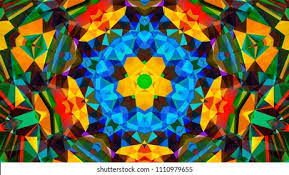
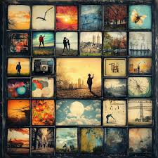

# jmei0847_9103_tut02_major-project

## 1. Instructions on how to interact with the work
- Click the "Original/Refresh" button at the top to refresh the canvas directly or reset the current canvas
Click 
- Click the "Random Draw" button to randomly generate different patterns on the canvas
- Click the "Rotate & Random draw" button to rotate the canvas and randomly generate  patterns
- Click the "Clear" button to clear the current canvas

## 2. Details of your individual approach to animating the group code.
### 2.1 Which method do you choose to drive your individual code?
User Input:Incorporate mouse or keyboard inputs for animation.

### 2.2 Which properties of the image will be animated and how?
I add a randomCircles() function to make the canvas to reveal only a few drawing patterns at a time. Also, I add a rotateCircles() function to make the canvas rotated and at the same time can also generate random patterns.
The canvas is refreshed each time the corresponding button is pressed, and random generaiton works. Also, random generation also works when the canvas is rotated.

### 2.3 References to inspiration
My design's inspiration comes from the kaleidoscope and collage builder. 
When the rotate the kaleidoscope, each rotation brings a different visual picture. When the canvas rotates, it revolves around a rotating central point, constantly generating various shapes, and as the canvas rotates, each shape gradually changes color or appears or disappears, producing a dreamlike visual effect.
When random draw the patterns on canva, it is like the random appearance of various graphics on a fixed canvas, different colors, random combinations, so that each frame has a new sense of abstract art.

### 2.4 Short technical explanation
In the functions which acts on the buttons, I referred to The Coding Train's tutorial that talking about how to save the current transformation, then restore that transformaiton. In the function rotateCircles(), randomCircles(), and reset(), I use push() and pop() function to save their individual transformation to make each button can be separated from the function of other buttons.

- Therefore, the button "Original/Refresh" is used to only change the canva back to the original drawing or just refresh the page. I add random color changes to some of the patterns‘s function, which makes the image slightly different every time you click the button.
- The button "Random Draw" is used to randomly generate these patterns without changing the initial position of each pattern.
- The button “Random Draw" is used to make the entire canvas pattern to rotate, and each click will rotate the canvas and randomly generates these patterns.
- The button "Clear" can clear all the transformaiton at any time. And this time, when you click the "Original/Refresh" button again, the canva will back to the original state.

 [Link to The Coding Train: How to Rotate Shapes in p5.js (translate, rotate, push, pop)](https://www.youtube.com/watch?v=o9sgjuh-CBM&ab_channel=TheCodingTrain)

### 2.5 Changes to the group code
Based on the group code, I changed the color settings in these funcitons: ConcentricCircle, ComplexCircleWithDotsAndShapes,RadiantCircleWithRays. The colors in these three graphs now change randomly each time when you refresh the canvas. This makes the image look less stiff and more randomly generated.
